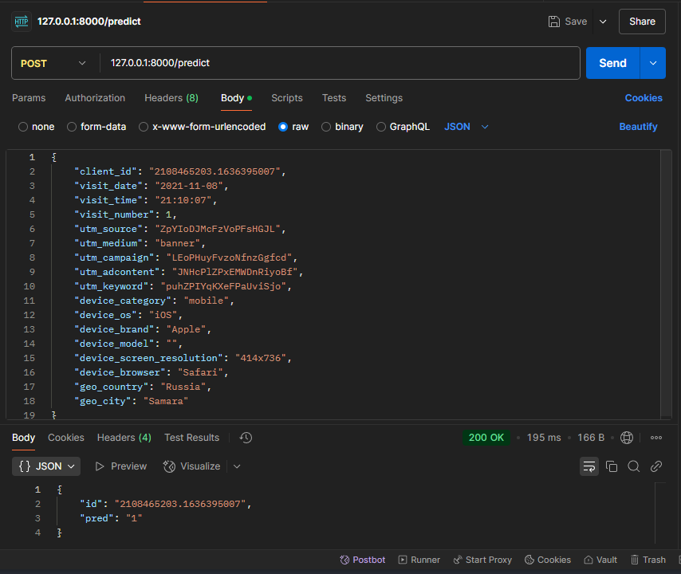

# Всем заитересованным привет. ML проект в свой полной крассе
## Запуск:
### Для запуска ван нужно выполнить несколько команда 
> создайте виртуально окружение python -m venv venv

> активируйте виртуально окружение .\venv\Scripts\activate

> установка всех зависимостей pip install --upgrade -r requirements.txt

> запуск локального сервера uvicorn service:app --reload


## Использование:

*  _localhost_/status -- получите статус работы модели __GET__ Запрос
*  _localhost_/version -- получите информацию о модели __GET__ Запрос
*  _localhost_/predict -- получите предикт модели __POST__ Запрос, также нужно передать в _BODY_ словарь с данными

### Пример словаря:
```json
{
    "client_id": "2108465203.1636395007",
    "visit_date": "2021-11-08",
    "visit_time": "21:10:07",
    "visit_number": 1,
    "utm_source": "ZpYIoDJMcFzVoPFsHGJL",
    "utm_medium": "banner",
    "utm_campaign": "LEoPHuyFvzoNfnzGgfcd",
    "utm_adcontent": "JNHcPlZPxEMWDnRiyoBf",
    "utm_keyword": "puhZPIYqKXeFPaUviSjo",
    "device_category": "mobile",
    "device_os": "iOS",
    "device_brand": "Apple",
    "device_model": "",
    "device_screen_resolution": "414x736",
    "device_browser": "Safari",
    "geo_country": "Russia",
    "geo_city": "Samara"
}
```

> Такой словарь вернёт 1 (Было выполненно целевой действие)

## Пример работы:

### Predict



### Status


### Version

